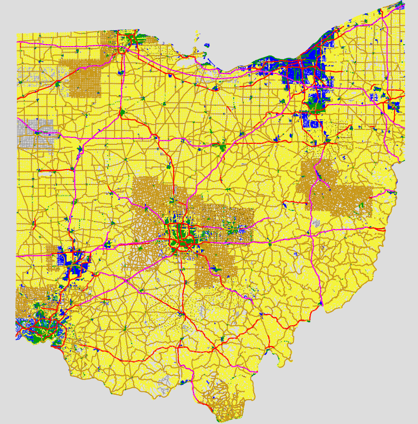

# OhioRoads

Map tiles generated by [Mapnik](https://mapnik.org/) using the [Ohio Department of Transportation's](https://gis.dot.state.oh.us/tims/) road inventory data.

**[View the tiles using Leaflet](https://mblaine.github.io/OhioRoads/)**

Imagery URL: `tms[19]:https://tiles.mblaine.com/ohio/{zoom}/{x}/{y}.png`

[Data source](https://gis.dot.state.oh.us/tims/Data/Download) (Under "Roadway Information" - "Road Inventory")

[OSM Community Forum post](https://community.openstreetmap.org/t/road-map-tiles-from-ohio-government-data/115997)

#### Key:

The map includes markers where road names begin and end. They're yellow and purple for the sake of contrast. The angled ones are where one name ends, and the straight ones are for cases of only two roads connecting but not at an intersection.

#### Notes

* Physical widths are all in feet and the roads that have them have names in black with a yellow outline.
* The middle width number is the carraigeway. The other two numbers are for the shoulders, if defined for that road.
* Shoulder widths are blank where not specified, and displayed as just an apostrophe.
* If the physical road widths are useful to anyone, 100% of them still need to be double checked before using them. Sometimes the width will be for more than one parallel carriageway, and sometimes the shoulder will be doubled or otherwise seem to represent more than the actual paved shoulder.
* Every road has a route number of some kind, displayed below its name at zoom 16 and above. The five digit municipal (MR) and township routes (TR) are most likely not visible on road signs anywhere.
* The speed limit and surface of each road is included along its edges as text to save needing to look at the key.
* This data was last updated by ODOT on June 20, 2024. Updates are released annually.

#### Surface types
Here are ODOT's road surface type codes and how they are represented in this map:
| ODOT | Map |
| -------- | ------- |
|B - Brick|bricks
|C - Continuous reinforced|concrete
|D - Reinforced concrete|concrete
|E - Plain concrete|concrete
|G - Bituminous concrete|asphalt
|I - Chip seal on granular|chipseal
|K - Open graded bituminous|asphalt
|L - Chipseal or Micro|chipseal
|M - Gravel|gravel
|U - Unimproved|unpaved
|X - Right of way only|impassible, not a road

#### Example

